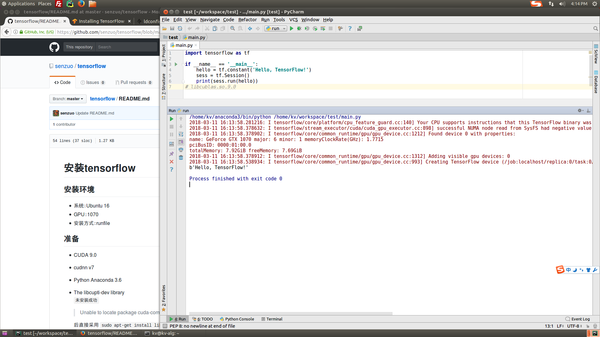

# 安装tensorflow

> Tensorflow 有两种类型 CPU和GPU
> GPU要比CPU快得多，此处接受GPU版本的安装
> 官方文档 https://tensorflow.google.cn/install/install_linux

## 安装环境

- 系统：Ubuntu 16.04 LTS 64bits
- GPU：GTX 1070

## 运行GPU支持的Tensorflow的要求

安装GPU版本的Tensorflow之前要安装的有

> 安装CUDA9.0和cuDNN请看对应文档

- CUDA® Toolkit 9.0   工具包
- The NVIDIA drivers  驱动
- cuDNN v7.0
- 计算能力3.0以上的显卡 查看显卡分数 https://developer.nvidia.com/cuda-gpus
- The libcupti-dev library\
  `未安装成功`
  > Unable to locate package cuda-command-line-tools
  
  后直接采用 `sudo apt-get install libcupti-dev` 并且添加环境变量
  ```bash
  $ export LD_LIBRARY_PATH=$LD_LIBRARY_PATH:/usr/local/cuda/extras/CUPTI/lib64
  ```

## 安装Tensorflow

安装GPU的准备工作完成后，开始正式安装Tensorflow，此处选择pip安装方式

### 安装python和pip

如果使用Anaconda安装，那么Python和pip应该已经安装完成 \
检查Python和pip的版本是否为3.6

``` bash
kv@kv-alg:~$ python --version
Python 3.6.1 :: Anaconda 4.4.0 (64-bit)
kv@kv-alg:~$ pip --version
pip 9.0.1 from /home/kv/anaconda3/lib/python3.6/site-packages (python 3.6)
kv@kv-alg:~$
```

### 安装 Tensorflow

```bash
$ pip install tensorflow-gpu
```

## 验证安装是否成功

### 准备环境

1. 打开终端  按 `ctrl + alt + t`
2. 键入 python 回车
3. 输入
``` python
# Python
import tensorflow as tf
hello = tf.constant('Hello, TensorFlow!')
sess = tf.Session()
print(sess.run(hello))
```
4. 如果系统输出 `Hello, TensorFlow!` 安装完成

### 问题

1.出现warning

> FutureWarning: Conversion of the second argument of issubdtype from `float` to `np.floating` is deprecated

使用 `pip install numpy==1.13.0` 解决

2.黑窗可以正常运行，但是pycharm不可以正常运行出现Error

> ImportError: libcublas.so.9.0: cannot open shared object file: No such file or directory 

查阅网上出现此问题应该是tensorflow版本和cuda版本不匹配，但是此处tensorflow1.6和cuda9.0是没有问题的 \
倒腾半天后不知道怎么就解决了（有可能是重启）




