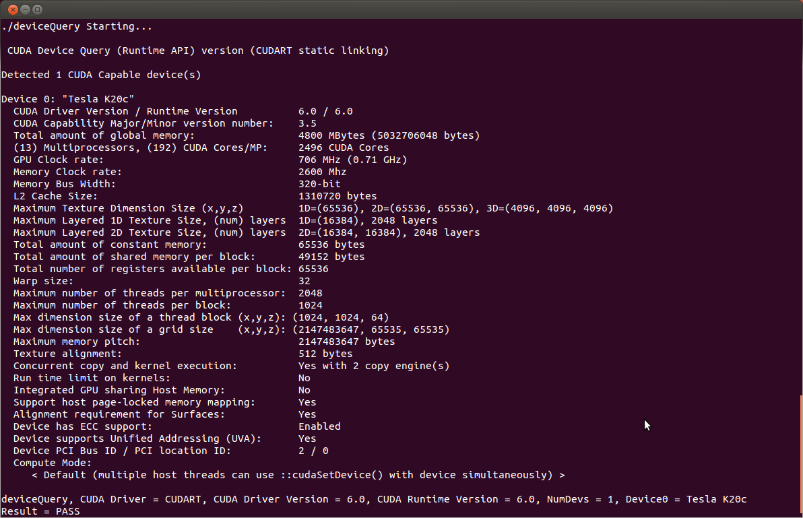

# 安装cuda

> 参考文档 http://docs.nvidia.com/cuda/cuda-installation-guide-linux/#axzz4VZnqTJ2A

## 安装前准备

1. 确认计算机可以检测到支持CUDA计算能力3.0以上的GPU

``` bash
# lspci：显示所有pci设备
$ lspci | grep -i nvidia
# 输出
# 01:00.0 VGA compatible controller: NVIDIA Corporation Device 1b81 (rev a1)
# 01:00.1 Audio device: NVIDIA Corporation Device 10f0 (rev a1)
```

2. 准备cuda_9.0.176_384.81_linux.run 安装文件


3. 确保系统有正确的内核header和安装开发包

``` bash
# 安装
$ sudo apt-get install linux-headers-$(uname -r)
```


## 安装CUDA
选择安装方式 -> **runfile**安装

> The Runfile installation installs the NVIDIA Driver, CUDA Toolkit, and CUDA Samples via an interactive text-based interface.
> 参考文档
> http://docs.nvidia.com/cuda/cuda-quick-start-guide/index.html#ubuntu-x86_64-run


1. 禁用 Nouveau 驱动: 

    创建文件 /etc/modprobe.d/blacklist-nouveau.conf 文件内容为

``` bash
    blacklist nouveau
    options nouveau modeset=0
```

	重新生成 the kernel initramfs:

``` bash
$ sudo update-initramfs -u
```

2. 通过暂时在系统内核启动参数添加数字3重启进入级别3（text mode） \
*此处使用了其他方法* \
ps： 准备好runfile文件以及所在目录

	- 重启电脑，在登录界面 `Ctrl+AltF1` 进入text mode
	- 命令行输入 `sudo service lightdm stop` 关闭GUI

3. 切换到runfile目录

4. 安装 `$ sudo sh cuda*.run`
默认全部安装

5. 返回GUI。键入 `$ sudo service lightdm start` 后按 `ctrl alt f7`
	

## 安装后操作

### 一定要做的

环境变量

`PATH`应当包含 `/usr/local/cuda-9.0/bin`
添加以下语句到`~/.bashrc`文件最后
1. 打开该文件  `$ gedit ~/.bashrc`
2. 将语句添加到该文件末尾

``` bash
$ export PATH=/usr/local/cuda-9.0/bin${PATH:+:${PATH}}
```

64位机器runfile安装方式需要继续添加以下语句
``` bash
$ export LD_LIBRARY_PATH=/usr/local/cuda/lib64${LD_LIBRARY_PATH:+:${LD_LIBRARY_PATH}}
```

添加其他语句
```bash
$ export CUDA_HOME=/usr/local/cuda-9.0
```

配置立即生效
``` bash
$source ~/.bashrc 
```


### 确认安装

``` bash
# 确认版本
$ cat /proc/driver/nvidia/version 

# 编译样例
# 时间有几分钟
cd ~/~/NVIDIA_CUDA-9.1_Samples
make

# 运行
# 找到deviceQuery文件运行
./deviceQuery
```

如果显示 `Detected CUDA Capable device` 那么就应该安装完成了



